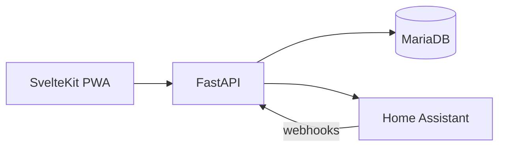

# CES — Design architecture reference

**Status:** Imported from App Design Document v1.0 (May 2026) and `contextual-executive-scaffold.zip`. Technical build plan: [BUILD_PLAN.md](../../BUILD_PLAN.md).

## Purpose and goals

CES is a self-hosted ADHD executive function support tool that externalises structure where internal regulation is weakest: initiation and completion of non-preferred tasks, home attentiveness, hyperfocus containment, and location-based priority shifts.

**Core objectives**

- External structure where internal regulation is weakest.
- Context-appropriate behaviour (work/study at work; home routines and wind-down at home).
- Gentle, user-controlled persistence — not punitive nagging.
- Self-insight through logging and reflection.
- Maintainable on Unraid with full data ownership.

## System architecture

| Layer | Choice |
|-------|--------|
| Database | MariaDB (`ces`, utf8mb4) — external in production; disposable container for local test |
| Backend | FastAPI, SQLAlchemy 2, Alembic |
| Frontend | SvelteKit static PWA, nginx proxy to API |
| Context | Home Assistant zones + manual override + last-known fallback |
| AI | OpenAI-compatible, on-demand only, cached by input hash |
| Nudges | User rules → HA actions + in-app banner; outcomes logged |

## Core features (design §3)

1. **Location-aware context switching** — HA zones map to context slugs; dashboard filters tasks.
2. **AI decomposition + implementation intentions** — “Break this down”; cache and manual paste supported on API.
3. **Visual timeline + timers** — Day view of tasks and focus sessions; focus start API.
4. **Hyperfocus containment** — `session_type: hyperfocus` with `end_condition`.
5. **Gentle persistence** — Nudge rules, evaluate endpoint, snooze/dismiss-for-today, pause mode.
6. **Reflection** — End-of-block logs; weekly review aggregates nudges and reflections.

## Data model (MariaDB)

| Table | Purpose |
|-------|---------|
| `contexts` | Named contexts, `location_rules` JSON, `accent_hue` for UI |
| `tasks` | Description, status, AI decomposition, implementation intention |
| `focus_sessions` | normal / hyperfocus timers |
| `nudge_rules` / `nudges` | Rules and fire outcomes |
| `ai_interactions` | Cache and audit trail |
| `reflection_logs` | worked / blocked / note |
| `app_settings` | pause mode, context override, dismiss-until |

## AI usage strategy

- Triggers: user actions only (no background polling).
- Cache: `input_hash` on normalised input + `prompt_type`.
- Degraded local behaviour: template micro-steps when `OPENAI_API_KEY` absent.

## Home Assistant

- Inbound: `POST /api/v1/webhooks/ha` with `X-HA-Secret`; actions `CES_SNOOZE_60`, `CES_MARK_REVIEWED`, evaluate trigger.
- Outbound: `GET /api/v1/ha/zones`, `POST /api/v1/ha/execute` (mock when token missing).
- Examples: [docs/ha-examples.yaml](../ha-examples.yaml).

## Sustainability safeguards

- Pause mode disables nudge evaluation.
- No auto-escalation; dismiss-for-today honoured.
- Export via `GET /api/v1/export`.
- User-owned data on self-hosted infra.

## Evidence (summary)

- Implementation intentions (Gollwitzer): medium-to-large effects on goal attainment.
- Time externalisation: compensatory visual timers for time perception deficits.
- Gentle accountability: salient, autonomy-preserving nudges.
- Organisational skills training and context-dependent cueing for adults with ADHD.

Full interactive prototype and screen flows: [docs/design/README.md](../design/README.md).

## Local vs production

| | Local Docker | Production (Unraid) |
|---|--------------|---------------------|
| DB | `db` service in compose | External MariaDB LAN IP |
| Secrets | Optional / mock | `CES_API_KEY`, `HA_TOKEN`, `OPENAI_API_KEY` |
| HTTPS | HTTP localhost | Reverse proxy for iOS PWA |

See [docs/REMAINING.md](../REMAINING.md) for post-MVP work.